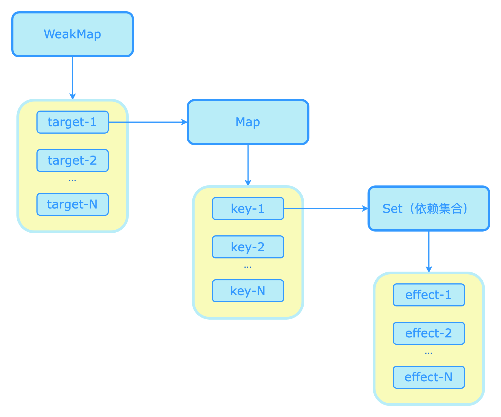

## 第二篇 响应系统

### 第4章 响应系统的作用与实现

#### 4.1 响应式数据与副作用函数

* 副作用函数：会直接或间接对外部造成影响的函数，例如修改了全局变量。
* 响应式：修改了某个值的时候，某个会读取该值的副作用函数能够自动重新执行。

#### 4.2 响应式数据的基本实现

如何实现响应式：

* 1、副作用读取值的时候，把函数放到值的某个桶里
* 2、重新给值赋值的时候，执行桶里的函数

在 Vue2 中通过 Object.defineProperty 实现，Vue3 通过 Proxy 实现。

```js
// 存储副作用的“桶”
const bucket = new Set();

// 原始数据
const data = { text: "Hello world." };
// 对原始数据进行代理
const obj = new Proxy(data, {
    // 拦截读取操作
    get(target, key) {
        // 将副作用函数加入 bucket 中
        bucket.add(effect);
        // 返回属性值
        return target[key];
    },

    // 拦截设置操作
    set(target, key, value) {
        // 设置属性值
        target[key] = value;
        // 把副作用函数从 bucket 中取出并执行
        bucket.forEach((fn) => fn());
        console.log('bucket:', bucket);
        // 返回 true 表示设置操作成功
        return true;
    },
});
```

#### 4.3 设计一个完善的响应系统

上面的实现硬编码了函数名，现在在全局维护一个变量来存储这个副作用函数。代码如下：

```js
// 用一个全局变量来存储被注册的副作用函数
let activeEffect;

// effect 函数用来注册副作用函数
function effect (fn) {
  // 当调用 effect() 函数时，将副作用函数 fn() 赋值给 activeEffect
  activeEffect = fn
  // 执行副作用函数
  fn()
}
```

这样我们就可以使用 `effect()` 函数来注册一个副作用函数：

```js
effect(
  // 一个匿名的副作用函数
  () => {
    document.querySelector('#root').textContent = obj.text
  }
)
```

我们的响应式系统也需要进行一些修改：

```js
// 存储副作用函数的“桶”
const bucket = new Set();

// 原始数据
const data = { text: "Hello, world." };
// 对原始数据进行代理
const obj = new Proxy(obj, {
    // 拦截读取操作
    get(target, key) {
        // 将 activeEffect 中存储的副作用函数加入 bucket 中
        if (activeEffect) {
            bucket.add(activeEffect);
        }
        // 返回属性值
        return target[key];
    },
    // 拦截设置操作
    set(target, key, value) {
        // 设置属性值
        target[key] = value;
        // 把副作用函数从 bucket 中取出并执行
        bucket.forEach((fn) => fn());

        // 返回 true 表示设置操作成功
        return true;
    }
})
```

改造后，响应式系统就不再依赖副作用函数的名称了。

但是，如果我们在 obj 上设置一个不存在的新属性时，也会触发副作用函数重新执行，这是不正确的，如下：

```js
effect(
  // 副作用函数
  () => {
    console.log('effect run.') // 会执行两次
    document.querySelector('#root').textContent = obj.text
  }
)

setTimeout(() => {
  obj.notExist = 'Hello vue.'
}, 1000)
```

导致该问题的原因是：**没有在【副作用函数】与【被操作的目标属性之】间建立明确的关系。** 无论我们设置的是什么属性，副作用函数都会被收集到 bucket 中。

而解决的方法也很简单，我们只需要把副作用函数与被操作的目录属性关联起来即可。在实现这一点之前，我们先看一下以下的代码：

```js
effect(function effectFn () {
  document.querySelector('#root').textContent = obj.text
})
```

在这段代码中，存在三个角色：

1. 被操作的对象：`obj`；
2. 被操作的属性：`text`；
3. 使用 `effect` 注册的副作用函数 `effectFn`。

如果用 `target` 表示被操作的对象，`key` 表示被操作的属性，`effectFn` 表示副作用函数，那么可以为这三个角色建立如下关系：

```shell
target
  └-- key
  	     └-- effectFn
```

* 一个 `target` 可以有多个 `key`
* 一个 `key` 可以有多个 `effectFn`；
* 一个 `effectFn` 可以对应多个 `key。

针对以上的分析，我们需要重新设计响应式系统：

```js
// 用一个全局变量来存储被注册的副作用函数
let activeEffect;

// effect 函数用来注册副作用函数
function effect(fn) {
    // 当调用 effect() 函数时，将副作用函数 fn() 赋值给 activeEffect
    activeEffect = fn;
    // 执行副作用函数
    fn();
}

// 存储副作用的“桶”
const bucket = new WeakMap(); // 它的 key 是 target，value 是一个 Map

// 原始数据
const data = { text: 'Hello, world.' }
// 对原始数据进行代理
const obj = new Proxy(data, {
    // 拦截读取操作
    get(target, key) {
        // 如果不存在副作用函数，直接返回
        if (!activeEffect) return target[key];

        // 根据 target 从 bucket 中取出 depsMap
        let depsMap = bucket.get(target);
        // 如果 depsMap 不存在，那么新建一个 Map 并与 target 关联，它是一个 Map 类型，结构为：key -> effects
        if (!depsMap) {
            bucket.set(target, (depsMap = new Map()))
        }

        // 再根据 key 从 depsMap 中取出 deps，他是一个 Set 类型，里面存储着所有与当前 key 相关的副作用函数
        let deps = depsMap.get(key);
        // 如果 deps 不存在，同样新建一个 Set，并与 key 关联
        if (!deps) {
            depsMap.set(key, (deps = new Set()))
        }

        // 最后将当前激活的副作用函数添加到 “桶” 里面
        deps.add(activeEffect)

        // 返回属性值
        return target[key];
    },
    // 拦截设置操作
    set(target, key, value) {
        // 设置属性值
        target[key] = value;

        // 根据 target 从 bucket 中取出对应的 depsMap
        const depsMap = bucket.get(target);
        if (!depsMap) return true;

        // 根据 key 从 depsMap 中取出所以的副作用函数 effects，它的结构为：key -> effects
        const effects = depsMap.get(key);
        effects && effects.forEach(fn => fn()); // 执行副作用函数

        // 返回 true 表示设置属性成功
        return true;
    }
})
```

从以上代码中可以看出构建数据结构的方式，我们分别使用了 WeakMap、Map 和 Set：

* WeakMap 由 target: Map 构成；
* Map 由 key: Set 构成；
* Set 中存储的是依赖集合。

它们之间的关系如下图所示：



##### Map 与 WeakMap 的关系

弄清楚他们之间的关系后，我们有必要解释一下这里为什么使用 WeakMap，我们看下以下代码：

```js
const map = new Map()
const weakMap = new WeakMap()

;(function () {
  const x = { x: 1 }
  const y = { y: 1 }

  map.set(x, 1)
  weakMap.set(y, 1)
})()

console.log(map)
console.log(weakMap)
```

以上这段代码中，我们定义了 map 和 weakMap 常量，当立即执行函数（IIFE）执行完毕后：

* x 仍然作为 map 的 key 被引用着，因此垃圾回收器不会把它从内存中移除，我们仍然可以通过 map.keys() 来获取到 foo 对象；

* 而对于 y 来说，由于  WeakMap 的是 key 是弱引用，在表达式执行完毕后垃圾回收器会将对象 y 从内存中移除，并且我们无法获取 WeakMap 的 key 值，也就无法通过 weakMap 来获取 y 对象。

> 测试方式：等待一段时间或手动执行Chrome的GC操作，再次打印 weakMap 将输出空对象。

因为 WeakMap 的 key 是弱引用这一特性，所以我们在存储 一些只有当 key 所引用的对象存在时（没有被回收）才有价值的信息，比如上面的场景中，如果 target 对象没有任何引用了，说明用户不再需要它了，这时垃圾回收器会完成回收任务。

而如果使用 Map 来代替 WeakMap 那么即使用户的代码对 target 没有任何引用，这个 target 也不会被回收，最后可能导致内存溢出。

##### 封装 track 和 trigger

最后，我们对之前封装的代码作一些提取处理：把 get 拦截中的部分逻辑单独封装到一个 track() 函数中，track 表示追踪的意思；同样把 set 拦截中的部分逻辑单独封装到一个 trigger() 函数中，trigger 表示触发的意思。

```js
// 用一个全局变量来存储被注册的副作用函数
let activeEffect;

// effect 函数用来注册副作用函数
function effect(fn) {
    // 当调用 effect() 函数时，将副作用函数 fn() 赋值给 activeEffect
    activeEffect = fn;
    // 执行副作用函数
    fn();
}

// 存储副作用的“桶”
const bucket = new WeakMap()

// 原始数据
const data = { text: 'Hello world.' }
// 对原始数据进行代理
const obj = new Proxy(data, {
    // 拦截读取操作
    get(target, key) {
        track(target, key)
        // 返回属性值
        return target[key]
    },

    // 拦截设置操作
    set(target, key, value) {
        // 设置属性值
        target[key] = value

        trigger(target, key)
        // 返回 true 表示设置操作成功
        return true
    }
})

function track(target, key) {
    // 如果不存在副作用函数，直接返回
    if (!activeEffect) return target[key];

    // 根据 target 从 bucket 中取出 depsMap
    let depsMap = bucket.get(target);
    // 如果 depsMap 不存在，那么新建一个 Map 并与 target 关联，它是一个 Map 类型，结构为：key -> effects
    if (!depsMap) {
        bucket.set(target, (depsMap = new Map()))
    }

    // 再根据 key 从 depsMap 中取出 deps，它是一个 Set 类型，里面存储着所有与当前 key 相关的副作用函数
    let deps = depsMap.get(key);
    // 如果 deps 不存在，同样新建一个 Set，并与 key 关联
    if (!deps) {
        depsMap.set(key, (deps = new Set()))
    }

    // 最后将当前激活的副作用函数添加到 deps 里面
    deps.add(activeEffect)
}

function trigger(target, key) {
    // 根据 target 从 bucket 中取出对应的 depsMap
    const depsMap = bucket.get(target);
    if (!depsMap) return true;

    // 根据 key 从 depsMap 中取出所以的副作用函数 effects，它的结构为：key -> effects
    const effects = depsMap.get(key);
    effects && effects.forEach(fn => fn()); // 执行副作用函数
}
```

如上面的代码所示，分别把逻辑封装到 track() 和 trigger() 中，这能为我们带来极大的灵活性。

#### 4.4 分支切换与 cleanup
#### 4.5 嵌套的 effect 与 effect 栈
#### 4.6 避免无限递归循环
#### 4.7 调度执行
#### 4.8 计算属性 computed 与 lazy
#### 4.9 watch 的实现原理
#### 4.10 立即执行的 watch 与回调执行时机
#### 4.11 过期的副作用
#### 4.12 总结
